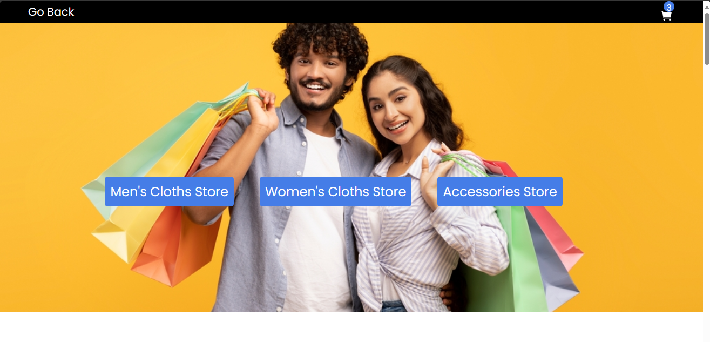
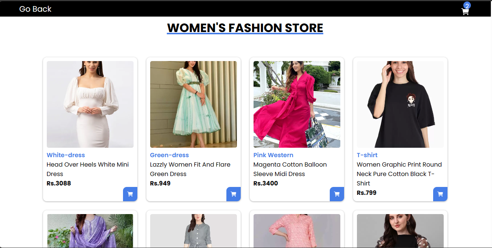
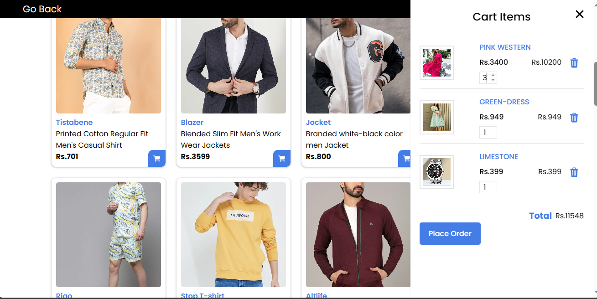

## Fashion World E-commerce Website using HTML, CSS3, JS.

## Introduction
- This is a Fashion World E-commerce website, created by HTML, CSS, and JS. In there, the user gets all product details, adds the products as favorites & buys products.

**Live Demo: https://fashionworldshop.netlify.app/**

## Description
- Welcome to Fashion World, your one-stop destination for fashion enthusiasts! We are excited to showcase our exceptional range of clothing and accessories to cater to your style needs. Our mission is to provide you with a seamless and enjoyable online shopping experience, ensuring that you find the perfect outfit for every occasion.

## Website Requirements Points

1. Modules to be made : 
- Navigation
- Home page
- Product page
- Cart system
- Product/order placement page

2. When the app starts, the app loads the list of the products and displays the product with specified data. 
 - There can be a number of navigations in the header/drawer. eg: Home , My Favourites,My Cart , My Account,etc. 

- Users can select one or more products. 

- Users can add the products to the cart system. 

- Users can see the selected products in the cart system. 

- Users can remove the product from the cart.

- Users can buy a product. 

- When a user goes to buy a product, he/she will get a form in which he/she must fill the mandatory fields like Name, email, Phone Number, Address, etc.

- After filling out the form, the user will get a message for successful order placement.

- The website should be fully responsive.

## Website View Pages

**Home Page**

**Category Page**

**Products Page**

**AddToCard Page**

**Payment Page**

